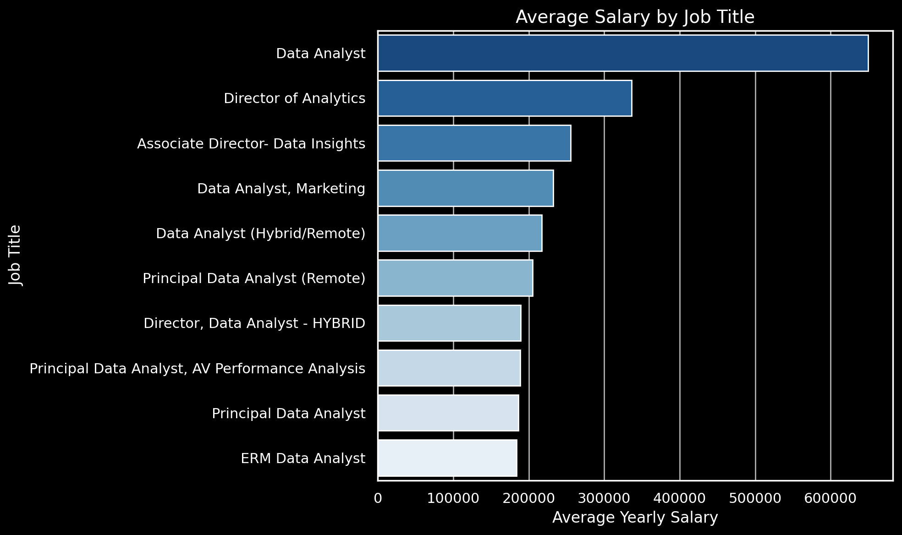
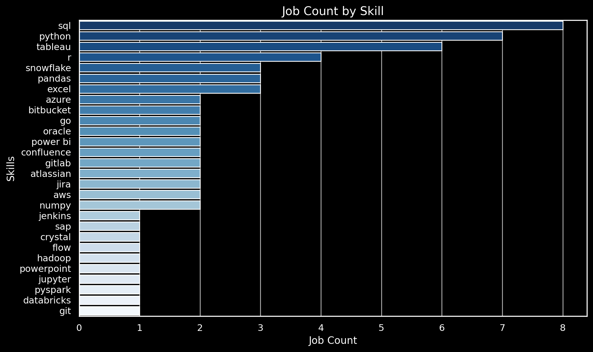

# Introduction
I delve into the data job market with a focus on data analyst roles. This project is a personal exploration into identifying the top-paying jobs, in-demand skills, and the intersection of high demand with high salary in the field of data analytics.

Check out my SQL queries here: [Project_SQL folder](/Project_SQL/).

# Background
I aimed to discover which skills are paid the most and in demand, making my job search more targeted and effective. 

The data for this analysis is from Luke Barousse’s [SQL Course](https://www.lukebarousse.com/sql). This data includes details on job titles, salaries, locations, and required skills. 

The questions I wanted to answer through my SQL queries were:

1. What are the top-paying data analyst jobs?
2. What skills are required for these top-paying jobs?
3. What skills are most in demand for data analysts?
4. Which skills are associated with higher salaries?
5. What are the most optimal skills to learn for a data analyst looking to maximize job market value?

# Tools I Used
- **SQL** (Structured Query Language): Enabled me to interact with the database, extract insights, and answer my key questions through queries.
- **PostgreSQL**: As the database management system, PostgreSQL allowed me to store, query, and manipulate the job posting data.
- **Visual Studio Code:** This open-source administration and development platform helped me manage the database and execute SQL queries.

# The Analysis
Each query for this project aimed at investigating specific aspects of the data analyst job market. Here’s how I approached each question:

### 1.Top Paying Data Analyst Jobs
To identify the highest-paying roles, I filtered data analyst positions by average yearly salary and location, focusing on remote jobs. This query highlights the high paying opportunities in the field.

```SQL
SELECT jf.job_id
,jf.job_title
,jf.job_location
,jf.job_schedule_type
,jf.salary_year_avg
,jf.job_posted_date
,cd.name as company_name

FROM job_postings_fact as jf

LEFT JOIN company_dim as cd
ON jf.company_id = cd.company_id

WHERE 1=1
AND jf.job_title_short = 'Data Analyst'
AND jf.job_location = 'Anywhere'
AND jf.salary_year_avg IS NOT NULL

ORDER BY jf.salary_year_avg DESC

LIMIT 10
```



*Bar graph visualizing the salary for the top 10 salaries for Data Analyst roles; ChatGTP generated this graph from the SQL query results*

- Higher-paying roles: Positions like "Data Analyst" and "Director of Analytics" offer significantly higher average salaries compared to other roles in the dataset.
- Director-level roles: Roles with titles including "Director" tend to cluster towards the top, indicating higher compensation compared to non-managerial positions.
- Salary variation: There's a noticeable gap between the highest-paying roles and the rest, suggesting a tiered salary structure depending on seniority and responsibilities.

### 2. Skills for Top Paying Jobs

To understand what skills are required for the top-paying jobs, I joined the job postings with the skills data, providing insights into what employers value for high-compensation roles.

```SQL
WITH top_paying_jobs AS (
    SELECT jf.job_id
    ,jf.job_title
    ,jf.salary_year_avg
    ,cd.name as company_name

    FROM job_postings_fact as jf

    LEFT JOIN company_dim as cd
    ON jf.company_id = cd.company_id

    WHERE 1=1
    AND jf.job_title_short = 'Data Analyst'
    AND jf.job_location = 'Anywhere'
    AND jf.salary_year_avg IS NOT NULL

    ORDER BY jf.salary_year_avg DESC

    LIMIT 10
)

SELECT tp.*
,sd.skills

FROM top_paying_jobs as tp

JOIN skills_job_dim as sj
ON tp.job_id = sj.job_id

JOIN skills_dim as sd 
ON sj.skill_id = sd.skill_id

ORDER BY salary_year_avg DESC
```

*Bar graph visualizing the top skills for Data Analyst roles; ChatGTP generated this graph from the SQL query results*

- SQL is the most frequently listed skill, appearing in 8 job postings.
Python is also highly valued, appearing in 7 job postings.
- Tableau is emphasized in 6 job postings, indicating a demand for data visualization skills.
R is mentioned in 4 job postings, suggesting its relevance for statistical analysis.
- Snowflake, a cloud data platform, appears in 3 job postings, reflecting its growing importance in data management.

### 3. In-Demand Skills for Data Analysts

This query helped identify the skills most frequently requested in job postings, directing focus to areas with high demand.

```SQL
SELECT sd.skills
,COUNT(sj.job_id) AS demand_count

FROM job_postings_fact as jf

INNER JOIN skills_job_dim as sj 
ON jf.job_id = sj.job_id

INNER JOIN skills_dim as sd 
ON sj.skill_id = sd.skill_id

WHERE 1=1
AND jf.job_title_short = 'Data Analyst'
AND jf.job_work_from_home = TRUE

GROUP BY sd.skills

ORDER BY demand_count DESC

LIMIT 5;
```
| Skills   | Demand Count |
|----------|--------------|
| SQL      | 7291         |
| Excel    | 4611         |
| Python   | 4330         |
| Tableau  | 3745         |
| Power BI | 2609         |

- SQL leads the demand: SQL has the highest demand, with 7,291 job mentions, indicating its importance across data-related roles.
- Excel and Python are close contenders: Excel (4,611) and Python (4,330) follow SQL, showing their critical role in data analysis and manipulation tasks.
- Tableau and Power BI are popular for visualization: Tableau (3,745) and Power BI (2,609) highlight the growing demand for skills in data visualization and business intelligence tools.

### 4. Skills Based on Salary

Exploring the average salaries associated with different skills revealed which skills are the highest paying.

```SQL
SELECT sd.skills
,ROUND(AVG(jf.salary_year_avg), 0) AS average_salary

FROM job_postings_fact as jf

INNER JOIN skills_job_dim as sj 
ON jf.job_id = sj.job_id

INNER JOIN skills_dim as sd 
ON sj.skill_id = sd.skill_id

WHERE 1=1
AND jf.job_title_short = 'Data Analyst'
AND jf.salary_year_avg IS NOT NULL
AND jf.job_work_from_home = TRUE

GROUP BY sd.skills

ORDER BY average_salary DESC

LIMIT 25;
```
| Skills          | Average Salary |
|-----------------|----------------|
| Pyspark         | 208172         |
| Bitbucket       | 189155         |
| Couchbase       | 160515         |
| Watson          | 160515         |
| Datarobot       | 155486         |
| Gitlab          | 154500         |
| Swift           | 153750         |
| Jupyter         | 152777         |
| Pandas          | 151821         |
| Elasticsearch   | 145000         |
| Golang          | 145000         |
| Numpy           | 143513         |
| Databricks      | 141907         |
| Linux           | 136508         |
| Kubernetes      | 132500         |
| Atlassian       | 131162         |
| Twilio          | 127000         |
| Airflow         | 126103         |
| Scikit-learn    | 125781         |
| Jenkins         | 125436         |
| Notion          | 125000         |
| Scala           | 124903         |
| Postgresql      | 123879         |
| GCP             | 122500         |
| Microstrategy   | 121619         |

- Pyspark leads in salary: Pyspark offers the highest average salary at $208,172, indicating its demand for large-scale data processing and analytics.
- Version control systems pay well: Bitbucket ($189,155) and Gitlab ($154,500) both command high salaries, reflecting the importance of version control and DevOps skills in modern development environments.
- Popular data science tools: Libraries like Pandas ($151,821), Numpy ($143,513), and Scikit-learn ($125,781) have competitive salaries, highlighting their crucial role in data manipulation and machine learning.

### 5. Most Optimal Skills to Learn

Combining insights from demand and salary data, this query aimed to pinpoint skills that are both in high demand and have high salaries, offering a strategic focus for skill development.

```SQL
WITH skills_demand AS(
    SELECT sd.skill_id 
    ,sd.skills
    ,COUNT(sj.job_id) AS demand_count

    FROM job_postings_fact as jf

    INNER JOIN skills_job_dim as sj 
    ON jf.job_id = sj.job_id

    INNER JOIN skills_dim as sd 
    ON sj.skill_id = sd.skill_id

    WHERE 1=1
    AND jf.job_title_short = 'Data Analyst'
    AND jf.job_work_from_home = TRUE
    AND jf.salary_year_avg IS NOT NULL

    GROUP BY sd.skill_id, sd.skills
)
,
 average_salary AS (
    SELECT sd.skill_id
    ,ROUND(AVG(jf.salary_year_avg), 0) AS average_salary

    FROM job_postings_fact as jf

    INNER JOIN skills_job_dim as sj 
    ON jf.job_id = sj.job_id

    INNER JOIN skills_dim as sd 
    ON sj.skill_id = sd.skill_id

    WHERE 1=1
    AND jf.job_title_short = 'Data Analyst'
    AND jf.job_work_from_home = TRUE
    AND jf.salary_year_avg IS NOT NULL

    GROUP BY sd.skill_id
)

SELECT sd.skill_id
,sd.skills
,demand_count
,average_salary

FROM skills_demand as sd

JOIN average_salary as avs
ON sd.skill_id = avs.skill_id

WHERE 1=1
AND demand_count > 10

ORDER BY average_salary DESC, demand_count DESC 
```
| Skill ID | Skills     | Demand Count | Average Salary |
|----------|------------|--------------|----------------|
| 8        | Go         | 27           | 115320         |
| 234      | Confluence | 11           | 114210         |
| 97       | Hadoop     | 22           | 113193         |
| 80       | Snowflake  | 37           | 112948         |
| 74       | Azure      | 34           | 111225         |
| 77       | BigQuery   | 13           | 109654         |
| 76       | AWS        | 32           | 108317         |
| 4        | Java       | 17           | 106906         |
| 194      | SSIS       | 12           | 106683         |
| 233      | Jira       | 20           | 104918         |
| 79       | Oracle     | 37           | 104534         |
| 185      | Looker     | 49           | 103795         |
| 2        | NoSQL      | 13           | 101414         |
| 1        | Python     | 236          | 101397         |
| 5        | R          | 148          | 100499         |
| 78       | Redshift   | 16           | 99936          |
| 187      | Qlik       | 13           | 99631          |
| 182      | Tableau    | 230          | 99288          |
| 197      | SSRS       | 14           | 99171          |
| 92       | Spark      | 13           | 99077          |
| 13       | C++        | 11           | 98958          |
| 186      | SAS        | 63           | 98902          |
| 7        | SAS        | 63           | 98902          |
| 61       | SQL Server | 35           | 97786          |
| 9        | JavaScript | 20           | 97587          |
| 183      | Power BI   | 110          | 97431          |
| 0        | SQL        | 398          | 97237          |
| 215      | Flow       | 28           | 97200          |
| 201      | Alteryx    | 17           | 94145          |
| 199      | SPSS       | 24           | 92170          |
| 198      | Outlook    | 13           | 90077          |
| 22       | VBA        | 24           | 88783          |
| 196      | PowerPoint | 58           | 88701          |
| 181      | Excel      | 256          | 87288          |
| 192      | Sheets     | 32           | 86088          |
| 188      | Word       | 48           | 82576          |
| 195      | SharePoint | 18           | 81634          |

- SQL and Python dominate in demand: SQL (398 mentions) and Python (236 mentions) are the most in-demand skills, reflecting their widespread use in data analysis and software development.
- Go offers the highest salary: Go, with an average salary of $115,320, stands out as the top-paying skill, despite having fewer job mentions (27), indicating its high value for specialized roles.
- Cloud skills are lucrative: AWS ($108,317), Azure ($111,225), and BigQuery ($109,654) highlight the premium salaries associated with cloud computing expertise, even with relatively lower demand counts.

# What I Learned

- **Complex Query Construction**: Learning to build advanced SQL queries that combine multiple tables and employ functions like **`WITH`** clauses for temporary tables.
- **Data Aggregation**: Utilizing **`GROUP BY`** and aggregate functions like **`COUNT()`** and **`AVG()`** to summarize data effectively.
- **Analytical Thinking**: Developing the ability to translate real-world questions into actionable SQL queries that got insightful answers.

# Insights

1. **Top-Paying Data Analyst Jobs**: The highest-paying jobs for data analysts that allow remote work offer a wide range of salaries, the highest at $650,000!
2. **Skills for Top-Paying Jobs**: High-paying data analyst jobs require advanced proficiency in SQL, suggesting it’s a critical skill for earning a top salary.
3. **Most In-Demand Skills**: SQL is also the most demanded skill in the data analyst job market, thus making it essential for job seekers.
4. **Skills with Higher Salaries**: Specialized skills, such as SVN and Solidity, are associated with the highest average salaries, indicating a premium on niche expertise.
5. **Optimal Skills for Job Market Value**: SQL leads in demand and offers for a high average salary, positioning it as one of the most optimal skills for data analysts to learn to maximize their market value.

# Conclusions
This project enhanced my SQL skills and provided valuable insights into the data analyst job market. The findings from the analysis serve as a guide to prioritizing skill development and job search efforts. Aspiring data analysts can better position themselves in a competitive job market by focusing on high-demand, high-salary skills. This exploration highlights the importance of continuous learning and adaptation to emerging trends in the field of data analytics.

